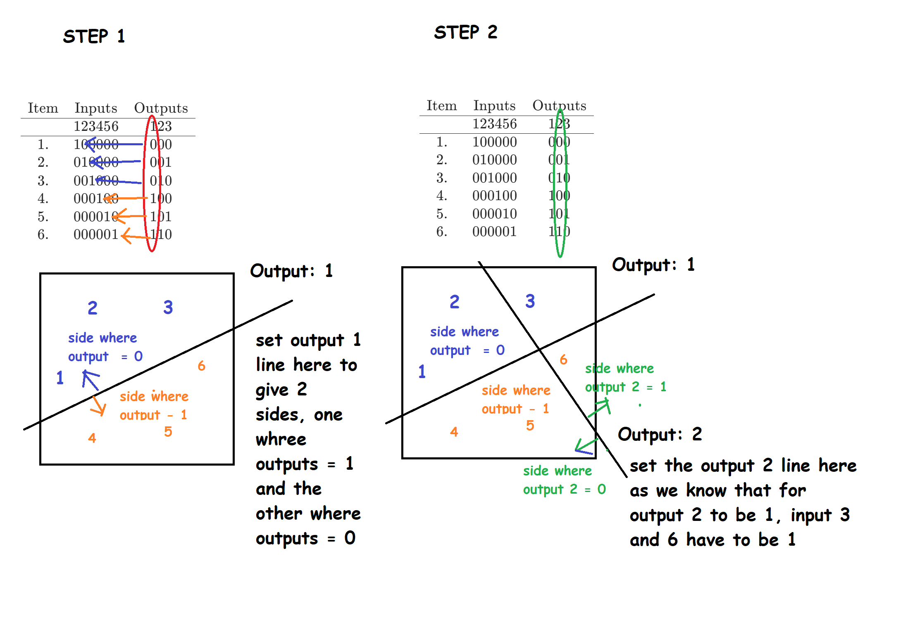
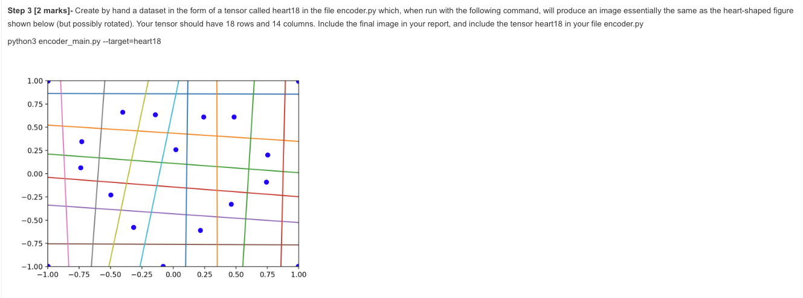
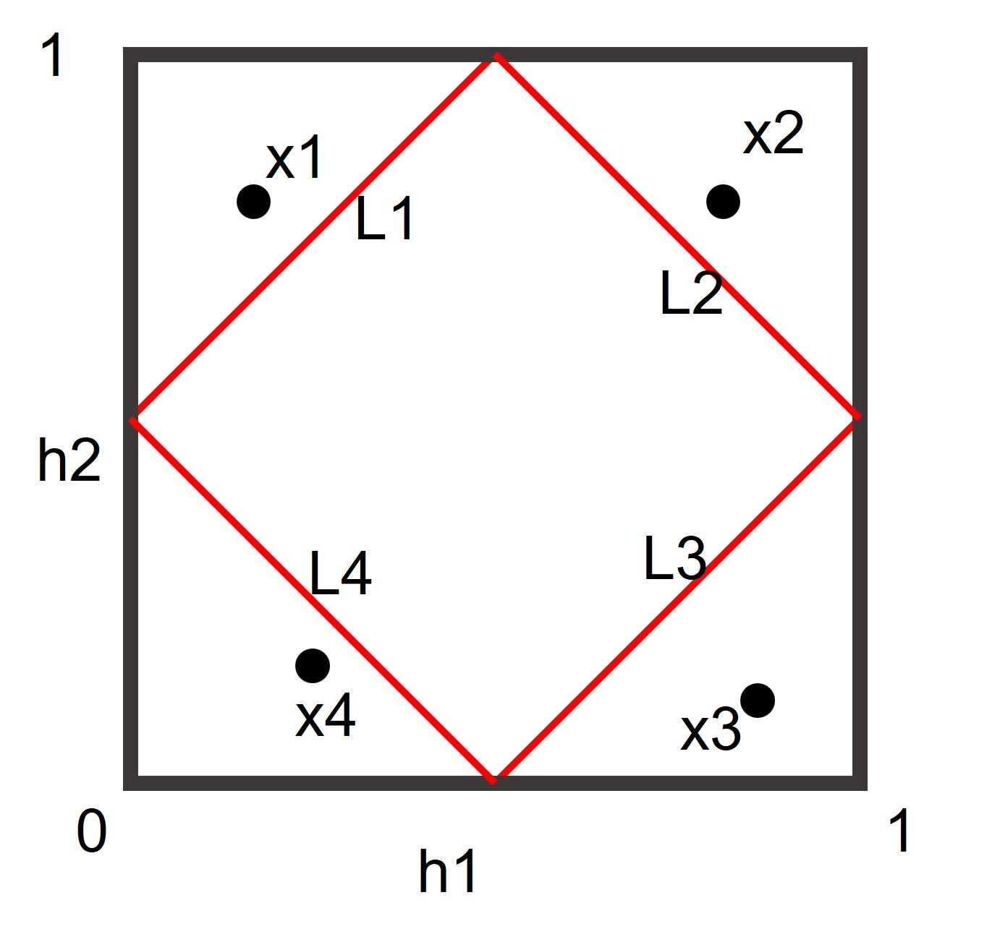

Hi all,

Many students asked questions about this assignment.

I want to give some hints about this task "Assignment2 Part 3 Step 3", the 
"heart shape" task. This is just one possible way (I can think) to understand 
and tackle this task. It is different to the solution Xuesong (our tutor) 
mentioned during the webinar. He will post his notes later.

The mechanism is related to the Q1 on this page 

https://edstem.org/au/courses/9353/lessons/24462/slides/172846

1. You want to map the 2-d hidden representation to the multi-dim output. You 
know how many lines (corresponding to the decoder) will you have. Manually draw 
these lines as grids on paper, like the example below.

2. Manually draw the dots in the grids, making them look like heart shapes -- 
only one point in one block, like the example below.

3. Given inputs (as a diagonal matrix if you concatenate all of them, like the 
example in the Q1), design the outputs to ensure the lines (corresponding to 
the decoder) divide the space as your manually drawn heart plots ... Please 
think about the relationship between lines  (and how they separate the dots) 
and the number of zeros in different columns (in the Q1). I explained this with 
the Q1 during the webinar, and James made a beautiful diagram for this 
(https://edstem.org/au/courses/9353/discussion/1015014).

You need to make some careful allocations or adjustments here.

(Sorry. I need to leave something for you to solve, so I cannot make this part 
with more details).

Best,

Dong

# Notes from XueSong
I've shared my solution to draw this diamond shaped plot (different from Dong's 
post) on colab, feel free to test it by yourself and share your concerns with 
us if there's any :)

reference `hidden_unit_dynamic.ipynb`

