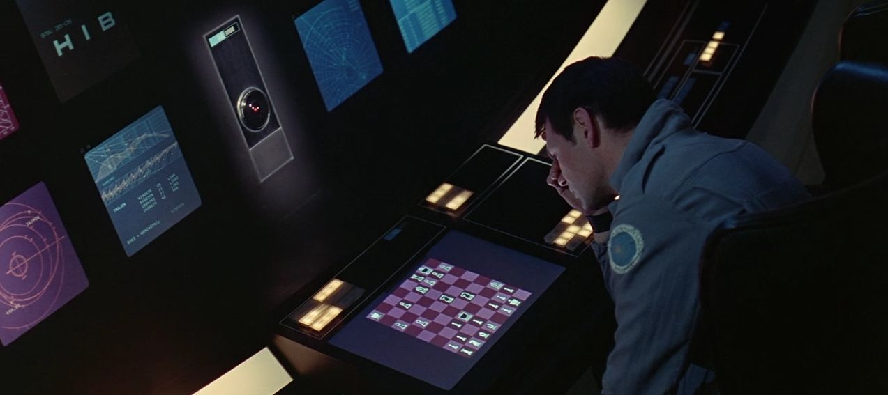

# Introduction to the Course

## Welcome to ZZEN9444 Neural Networks and Deep Learning!

Popular conceptions about Artificial Intelligence in the late 20th Century are 
nicely illustrated in this image from the classic film "2001: A Space Odyssey". 
For the original audience, the idea of a computer beating a human at Chess was 
considered outrageous. In contrast, the idea of a computer casually conversing 
with humans, identifying and classifying objects within a room hardly seemed 
shocking at all. Because humans perform these tasks so effortlessly, even 
unconsciously, the difficulty of reproducing them in computers was greatly 
underestimated.

In reality, Deep Blue defeated the human Chess champion Garry Kasparov in 1996, 
but it was not until nearly two decades later that computers were finally able 
to perform tasks such as object recognition and machine translation with any 
degree of precision. These advances were made possible by a class of models 
called Deep Neural Networks which are inspired by the structure of the human 
brain.

This course aims to introduce students to the main topics and methods in the 
field of neural networks and deep learning, ranging from traditional neural 
network models to the latest research and applications.

These are the topics that will be covered each week:
- **Week 1**: historical background, neuroanatomy, perceptrons, training of 
multi-layer neural networks by gradient descent, probability, supervised 
learning, generalization and overfitting, dropout.

- **Week 2**: Cross entropy, softmax, weight decay and momentum, introduction 
to PyTorch, analysis of hidden unit dynamics.

- **Week 3**: image processing and object recognition, including convolutional 
networks, weight initialization, batch normalization, skip connections and 
dense blocks.

- **Week 4**: recurrent neural networks, SRN, LSTM, GRU, hidden unit dynamics, 
word vectors, sequence and language processing.

- **Week 5**: reinforcement learning, models of optimality, TD-learning, 
Q-learning, policy gradients, actor-critic, deep reinforcement learning.

- **Week 6**: unsupervised learning, autoencoders, artist-critic coevolution, 
generative adversarial networks.

## Course Materials and Learning Strategies
The materials for this course are arranged in Weeks, with each week divided 
into several lessons. There will be an **online class** each week **Thursday 7pm**. 
You are expected to read through the course materials and watch the embedded 
videos prior to attending each online class.

There are also online **exercises** and **coding exercises**, which you can complete 
either before or after the online class each week. You should attempt to answer 
the questions yourself before looking at the sample answers.

Questions and discussion relating to all aspects of the course can be posted to 
the discussion board for this Ed site.

## Text Book
The textbook for this course is: Deep Learning By Ian Goodfellow, Yoshua Bengio 
and Aaron Courville, MIT Press 
    http://www.deeplearningbook.org - available for free online by the authors
Also available as physical copies at UNSW campuses, or to purchase.

## Assumed Knowledge
The course will assume knowledge of the following mathematical topics, which 
are also covered in the textbook (appropriate chapters linked below):
- Linear Algebra (chapter 2.1-2.8)
- Probability (chapter 3.1-3.14)
- Calculus and Chain Rule (chapter 6.5.2)

We recommend you study the relevant sections of the textbook (shown in brackets) 
and the support materials in Week 0, if necessary, to revise these topics on 
you own during the first few weeks of the course:
- Python refresher in Week 0
- Numpy refresher in Week 0
- Matplotlib refresher in Week 0
- Google Colab refresher in Week 0

## Plagiarism
Plagiarism is taken seriously by UNSW/CSE and treated as Academic Misconduct. 
ALL work submitted for assessment must be your own work.

For an individual assignment, collaborative work in the form of “think tanking” 
is encouraged, but students are not allowed to derive code together as a group 
during such discussions. In the case of a group assignment, code must not be 
obtained from outside the group.

Plagiarism detection software may be used on submitted work.

Academic Integrity and Plagiarism: https://student.unsw.edu.au/plagiarism

## Course Outline
The Course Outline is available in the Moodle course site.
