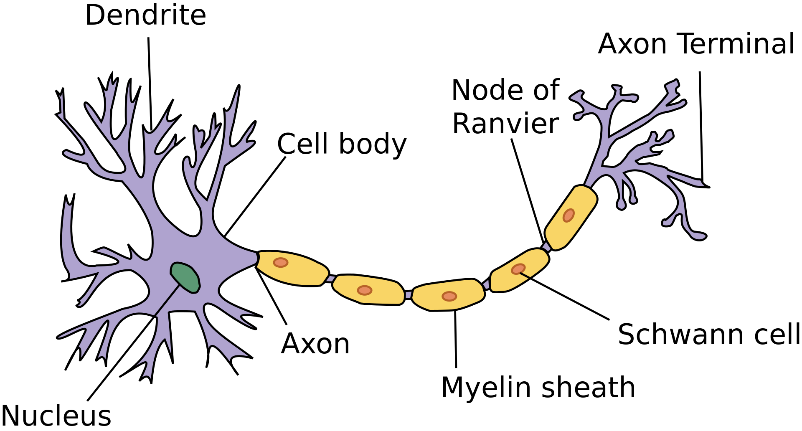
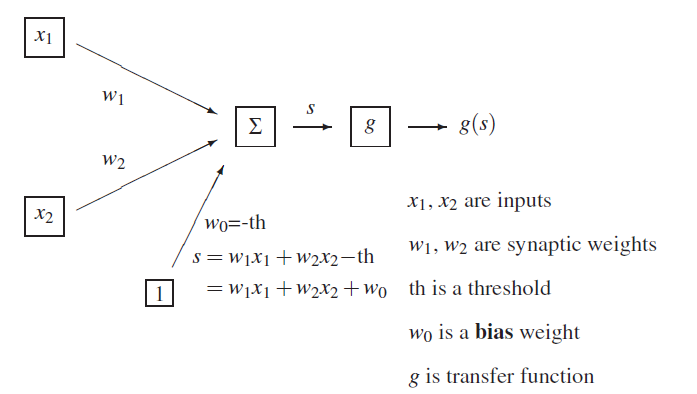
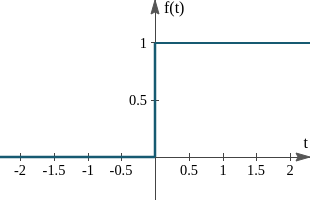
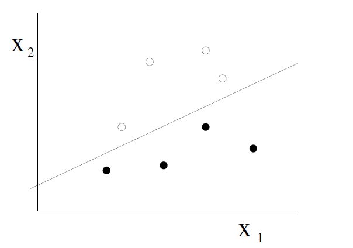
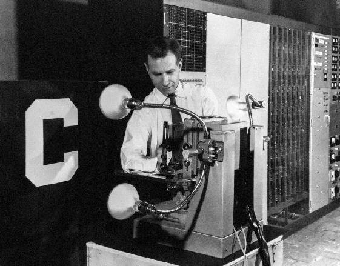
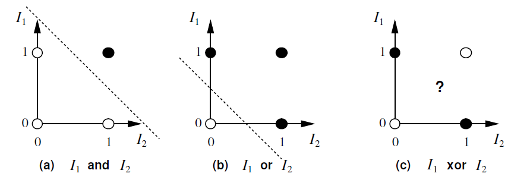

# Biological vs Artificial Neurons

## Biological Neurons

The brain is made up of neurons (nerve cells) which have:
- a cell body (soma)
- dendrites (inputs)
- an axon (output)
- synapses (connections between cells)

Synapses can be excitatory or inhibitory (https://www.youtube.com/watch?v=EVMbro2wblU&ab_channel=HarvardX), 
and may change over time. When the inputs reach some threshold, an action 
potential (electrical pulse) is sent along the axon to the output. 

# McCulloch & Pitts Neuron
In 1943, McCulloch and Pitts published a simplified mathematical model of a 
neuron. Each input $x_i$ is multiplied by a corresponding weight $w_0$ and the 
results are added together. An extra constant $w_0$ called the bias is also 
added.

$$s = w_0 _ \sum_i w_i x_i$$

Finally, a non-linear transfer function is applied to this linear combination 
to produce the output of the neuron.

$$z = g(s) = g(w_0 + \sum_i w_i X_i)$$

## Transfer Function
The original transfer function used by McCulloch and Pitts was a discontinuous 
step function (also called the Heaviside function).

$insert latex$

An artificial neuron with this transfer function is called a Perceptron.

In the early days, the negative of the bias $−w_0$ was thought of 
as a kind of threshold. If the combination $\sum_i w_i x_i$
exceeded this threshold, the neuron would "fire" (its output would be 1); 
otherwise, the neuron would not fire (its output would be 0). The subtracted 
threshold was changed to an additive bias for mathematical convenience. The 
higher the bias, the more likely the neuron is to fire.

Later on, alternative transfer functions were introduced which are continuous 
and (mostly) differentiable.

## Optional Video

## Linear Separability
The weights and bias of a Perceptron determine a hyperplane which divides the 
space of inputs into two regions. For inputs on one side of this hyperplane, 
the output will be 0; for inputs on the other side, the output will be 1.  
Functions which can be computed in this way are called Linearly Separable.

# Rosenblatt Perceptron

The Perceptron was introduced by Frank Rosenblatt in 1957. One of the tasks he 
was interested in was taking the pixels from black and white images of 
characters and using them to classify the images as 0,1,…,90, 1,\ldots,90,1,…,9 
or A,B,…,Z{\rm A},{\rm B},\ldots,{\rm Z}A,B,…,Z. For this task, we would need 
26 different perceptrons: one to classify each character as "A" or "not A", 
another for "B" or "not B", etc. up to "Z" or "not Z". If the images are, for 
example, 20×2020\times 2020×20, each perceptron would have 400400400 inputs 
x1,…,x400x_1,\ldots,x_{400}x1​,…,x400​.

## Logical Functions
Logical Functions

If we adopt the convention that 0=False0={\rm False}0=False and 
1=True1={\rm True}1=True, many simple logical functions like 
AND{\rm AND}AND, OR{\rm OR}OR and NOT{\rm NOT}NOT 
become linearly separable. We can use our knowledge of plane geometry to build 
Perceptrons to compute these functions. This diagram shows the AND an 
(inclusive) OR functions, which can be computed by Perceptrons, as well as the 
Exclusive OR (XOR) which cannot be computed by a Perceptron, because it is not 
linearly separable.

These are the weights for Perceptrons to compute the AND and OR function, and the opposite of OR, sometimes called NOR which stands for "Not OR".

 AND w1=w2=1.0,w0=−1.5 OR w1=w2=1.0,w0=−0.5 NOR w1=w2=−1.0,w0=0.5\begin{array}{cl}\text { AND } & w_{1}=w_{2}=\phantom{-}1.0, \quad w_{0}=-1.5 \\ \text { OR } & w_{1}=w_{2}=\phantom{-}1.0, \quad w_{0}=-0.5 \\ \text { NOR } & w_{1}=w_{2}=-1.0, \quad w_{0}=\phantom{-}0.5\end{array}
 AND  OR  NOR ​w1​=w2​=−1.0,w0​=−1.5w1​=w2​=−1.0,w0​=−0.5w1​=w2​=−1.0,w0​=−0.5​
 

# Perceptrons by hand
refer to video
