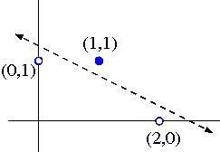
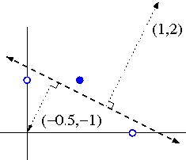

# Question 1

Construct by hand a Perceptron which correctly classifies the following data; 
use your knowledge of plane geometry to choose appropriate values for the 
weights $w_0, w_1$ and $w_2$

| training example | $x_1$ | $x_2$ | Class |
|------------------|-------|-------|-------|
| a.               | 0     | 1     | -1    |
| b.               | 2     | 0     | -1    |
| c.               | 1     | 1     | +1    |

Identify the equation of the line and the weights of the Perceptron (including 
bias). 

# Explanation

The first step is to plot the data on a 2-D graph, and draw a line which 
separates the positive from the negative data points:

This line has slope -½ and $x_2$-intersect dfrac{5}{4}, so its equation is:

$$x_2 = \dfrac{5}{4} - \dfrac{x_1}{2}$$ ie $$2x_1 + 4x_2 - 5 = 0$$

Taking account of which side is positive, this corresponds to these weights:

$w_0 = -5$
$w_1 = 2$
$w_2 = 4$

Alternatively, we can derive weights w1w_1w1​=1 and w2w_2w2​=2 by drawing 
a vector normal to the separating line, in the direction pointing towards the 
positive data points:

The bias weight $w_0$ can then be found by computing the dot product of 
the normal vector with a perpendicular vector from the separating line to the 
origin. In this case $w_0 = 1(-0.5) + 2(-1) = -2.5$

(Note: these weights differ from the previous ones by a normalizing constant, 
which is fine for a Perceptron)

# Question 2

Demonstrate the Perceptron Learning Algorithm on the above data, using a 
learning rate of 1.0 and initial weight values of

$$w_0 = -1.5$$
$$w_1 = 0$$
$$w_2 = 2$$

The first three steps are shown below. You should continue until all items are 
correctly classified.

| iteration | $w_0$  | $w_1$ | $w_2$ | Item | $x_1$ | $x_2$ | Class | $s = w_0 + w_1 x_1 + w_2 X_2$ | Action |
|-----------|--------|-------|-------|------|-------|-------|-------|-------------------------------|--------|
| 1         | -1.5   | 0     | 2     | a.   | 0     | 1     | -1    | +0.5                          | Subtract |
| 2         | -2.5   | 0     | 1     | b.   | 2     | 0     | -1    | -2.5                          | None |
| 3 | -2.5 | 0 | 1 | b. | 2     | 