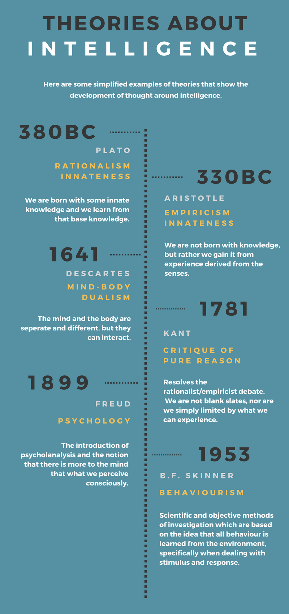
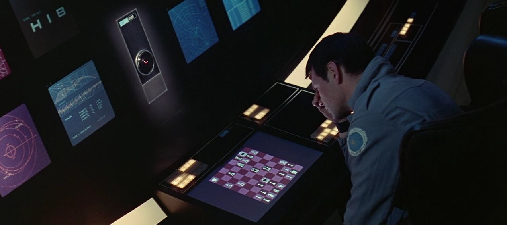
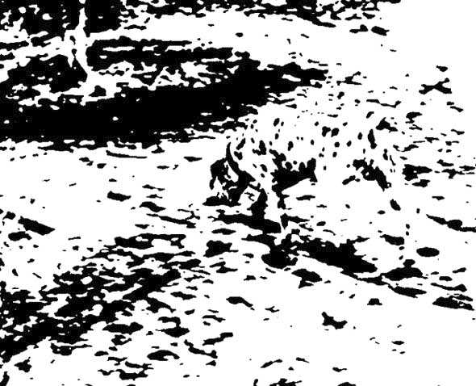
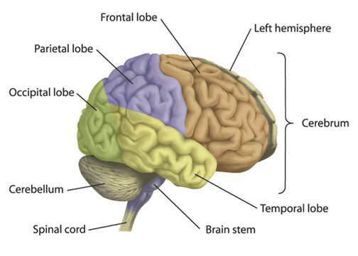
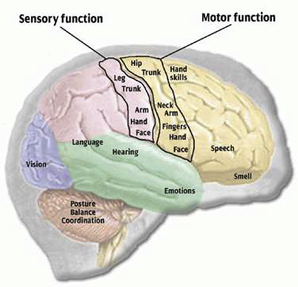
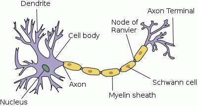
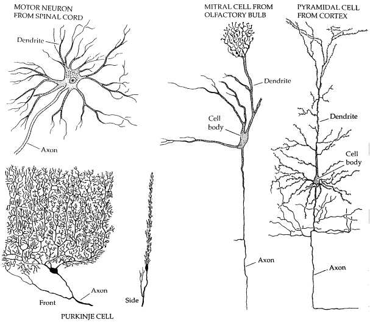
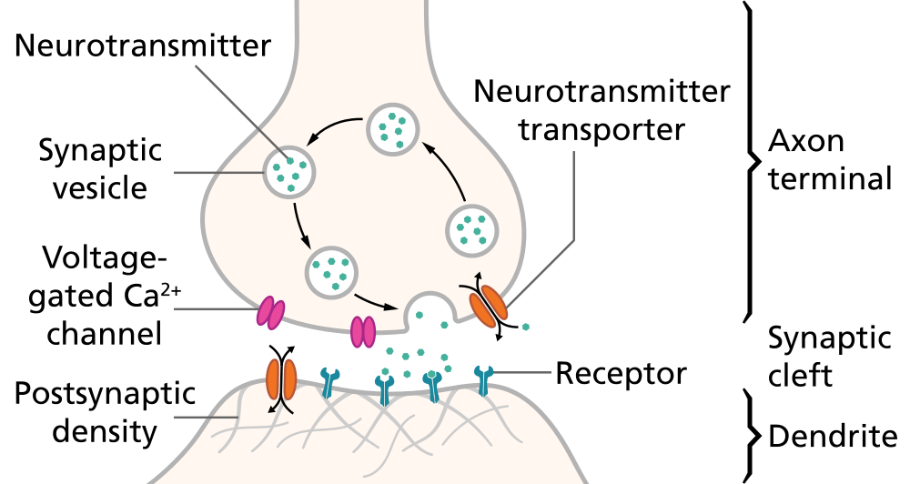

# Week 1: Overview
In this first lesson, we will look at the historical background of artificial 
intelligence and deep learning, biological and artificial neurons, the 
perceptron learning algorithm, and the training of multi-layer neural networks 
by gradient descent. 

We will briefly review certain topics from probability which are essential for 
deep learning, and we will introduce the issue of generalization and 
overfitting in supervised learning. 

## Weekly learning outcomes:
By the end of this week, you will be able to:
- construct perceptrons by hand 
- apply the Perceptron Learning Algorithm 
- construct multi-layer perceptrons by hand 
- explain how continuous activation functions allow multi-layer neural networks 
to be trained by gradient descent 
- compute Entropy and KL-Divergence for discrete probability distributions
- compute probabilities using Bayes’ Rule
- describe the basics of supervised learning
- explain how to avoid overfitting in neural networks

# History & Neuroanatomy

"For the machine is not a thinking being, but simply an automation which acts 
according to the laws imposed upon it."
 -−Ada Lovelace, 1843

The table above summarizes various theories which have been proposed throughout 
history to explain the workings of the human mind. The idea that human 
reasoning could be simulated by some kind of mechanical calculator dates back 
to Blaise Pascal and Gottfried Leibniz in the 1600's, was developed in the 
1800's by George Boole, Gottlob Frege, Charles Babbage and Ada Lovelace, and in 
the early 1900's by Alan Turing.

The modern field of Artificial Intelligence (AI) perhaps began in earnest with 
a workshop at Dartmouth College in the summer of 1956. In the early days of AI, 
researchers tended to focus on logical reasoning and problem-solving. Less 
attention was paid to perceptual tasks such as vision and language processing, 
because there was a general expectation that these tasks would be easily solved 
within a few years. In reality, these seemingly simple tasks turned out to be 
much more challenging, and were not achieved to any degree of proficiency until 
the second decade of the 21st Century. The major advances in these areas stem 
chiefly from a class of models called Deep Neural Networks which are inspired 
by the structure of the human brain.

## Sub Symbolic Processing

Can you see an animal in this picture? What kind of animal is it? What 
direction is it facing?

The human brain performs tasks such as object recognition unconsciously and in 
a highly distributed fashion. Low-level features are recognised in different 
parts of the image and are hierarchically combined into high level features 
from which the identity of the object is extracted.

## Basic neuroanatomy
https://youtu.be/owFnH01SD-s

## Cerebral Cortex

## Brain Functions

## Neurons
The body is made up of billions of cells. Cells of the nervous system, called 
neurons, are specialized to carry “messages” through an electrochemical 
process. The human brain has about 100 billion neurons, and a similar number of 
support cells called “glia”. Neurons share many functions in common with other 
cells in the body. For example, they are surrounded by a cell membrane, they 
have a nucleus containing genes (DNA), and they  carry out basic cellular 
processes like protein synthesis and energy production.

Neurons also have certain features which distinguish them from other body 
cells. They have specialized extensions called dendrites and axons. Dendrites 
bring information to the cell body, while axons take information away from the 
cell body. The axon of one neuron can connect to the dendrite of another neuron 
through an electrochemical junction called a synapse.

## variety of Neuron Types

Most neurons have only one axon, but the number of dendrites can vary widely. 
Unipolar and Bipolar neurons have only one dendrite, but Purkinje neurons in 
the cerebellum can have up to 100,000 dendrites. Dendrites are typically less 
than a millimetre in length. Axons can vary in length from less than a 
millimetre to more than a metre (for motor neurons). Long axons are sometimes 
surrounded by a myelinated sheath, which prevents the electrical signal from 
dispersing, and allows it to travel faster (up to 100 m/s).

## Synapses, Neurotransmitter and Ion Channels

An electrical pulse reaches the endbulb and causes the release of 
neurotransmitter molecules from little packets (vesicles) through the synaptic 
membrane. The transmitter passes through voltage-gated ion channels and 
diffuses through the synaptic cleft to the other side.

When the neurotransmitter reaches the post-synaptic membrane, it binds to 
receptors and causes a change in polarisation of the membrane. The change in 
potential can be excitatiory (moving the potential towards the threshold) or 
inhibitory (moving it away from the threshold).

In the next section, we will look at a simple mathematical model of the neuron 
which excludes most of the complex biological, chemical and physiological 
details and aims instead to capture the essential features of a neuron 
necessary for distributed computation.

## Further Reading
For more on the history of Deep Learning, consider these two perspectives: 

**Viewpoint 1**: Focusing on recent work (after 2012) 

https://www.cs.toronto.edu/~hinton/absps/NatureDeepReview.pdf 

**Viewpoint 2**: Focusing on earlier work (before 2012) 

http://people.idsia.ch/~juergen/deep-learning-overview.html

Textbook: Deep Learning (Goodfellow, Bengio, Courville, 2016):

historical trends in deep learning

https://www.deeplearningbook.org/contents/intro.html