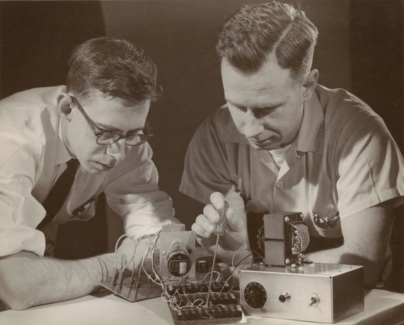
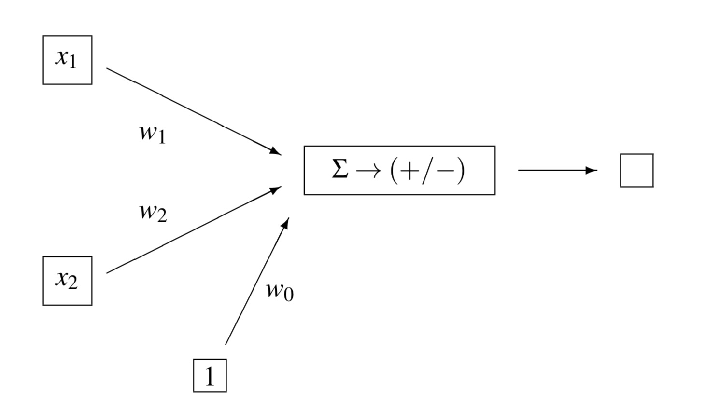
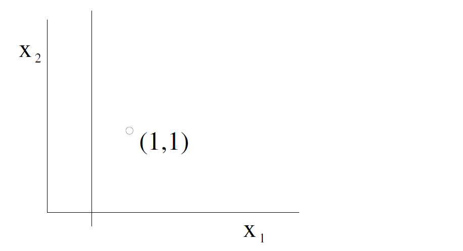
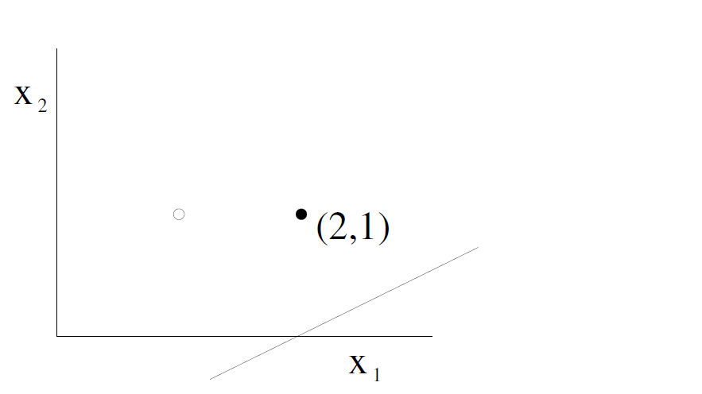
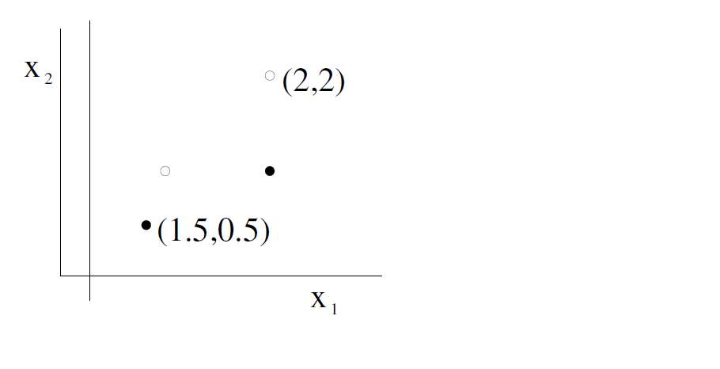
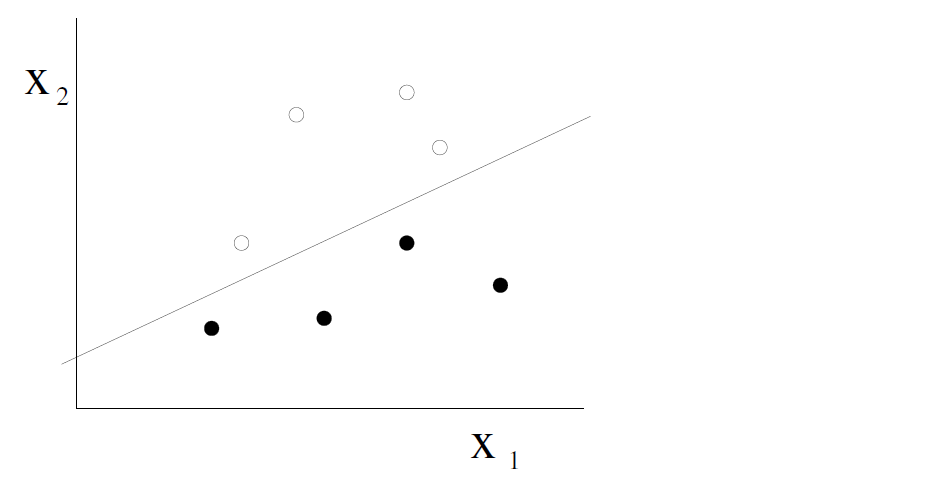

Perceptron Learning Algorithm
Supervised Learning

We have seen how simple Perceptrons can be constructed by hand to compute
logical functions in 2 dimensions. For larger tasks, such as the character
recognition task with 400400400 inputs extracted from a 20×\times×20 image, 
the weights clearly cannot be computed by hand. Instead, we seek an automated 
procedure which, given a set of labeled data, will automatically determine the 
weights and biases of a Perceptron to classify those data.

This is an example of Supervised Learning, which will be the focus of this 
course in Weeks 1-4. Reinforcement Learning will be covered in Week 5, and 
Unsupervised Learning in Week 6.

For Supervised Learning, we have a training set and a test set, each consisting 
of a set of items; for each item, a number of input attributes and a target 
value are specified. The aim is to predict the target value, based on the input 
attributes. The system is presented with the input and target output for each 
item in the training set; it must then predict the output for each item in the 
test set. 

# Rosenblatt Perceptron
The Perceptron Learning Algorithm was introduced by Frank Rosenblatt in 1957, 
and is one of the earliest examples of Supervised Learning.

Perceptron Learning Algorithm

The algorithm works as follows. The bias w0w_0w0​ and weights {wi}\{w_i\}{wi​} of the Perceptron are at first initialised to (small) random values. Then, the training items are presented one at a time, and appropriate changes are made to w0w_0w0​ and {wi}\{w_i\}{wi​}.

Recall that the output of the Perceptron is g(s)g(s)g(s) where s=w0+∑iwi xi s=w_0 + \sum_i w_i\,x_i\,s=w0​+∑i​wi​xi​.

Suppose an input {xi}\{x_i\}{xi​} is presented for which the target output is 111 but the actual output of the Perceptron is 000. In this case, we want to adjust w0w_0w0​ and {wi}\{w_i\}{wi​} in a way that will make sss larger for this particular choice of {xi}\{x_i\}{xi​}. We do this by making these adjustments, where η>0\eta>0η>0 is a constant called the learning rate:

w0←w0+ηwi←wi+η xiConsequently,s←s+η(1+∑kxk2)\begin{aligned}w_0 &\leftarrow w_0 + \eta\\w_i &\leftarrow w_i + \eta\,x_i \\{\rm Consequently,}\quad s &\leftarrow s+\eta(1+\sum_k x_k^2)\end{aligned}
w0​wi​Consequently,s​←w0​+η←wi​+ηxi​←s+η(1+k∑​xk2​)​

If the target output is 000 but the actual output is 111, we do the opposite, namely:

w0←w0−ηwi←wi−η xiConsequently,s←s−η(1+∑kxk2)\begin{aligned}w_0 &\leftarrow w_0 - \eta\\w_i &\leftarrow w_i - \eta\,x_i \\{\rm Consequently,}\quad s &\leftarrow s-\eta(1+\sum_k x_k^2)\end{aligned}
w0​wi​Consequently,s​←w0​−η←wi​−ηxi​←s−η(1+k∑​xk2​)​

If the actual output is equal to the target output, no change is made to the weights. We may need to cycle through the data several times but, if we reach a point where all the data are correctly classified, the algorithm terminates.

Rosenblatt proved that this algorithm will always learn to classify the 
training data successfully, provided the data are linearly separable.

## Perceptron Learning Example: 

Let's assume a learning rate of η=0.1\eta = 0.1η=0.1, with these initial weights:

w0=−0.1w1=0.2w2=0.0\begin{aligned}w_0 &= -0.1 \\w_1 &=\phantom{-}0.2 \\w_2 &=\phantom{-}0.0\end{aligned}
w0​w1​w2​​=−0.1=−0.2=−0.0​

Remember that the perceptron will classify as positive those items (x1,x2x_1,x_2x1​,x2​) for which

s=w0+w1x1+w2x2>0s = w_0 + w_1 x_1 + w_2 x_2 > 0
s=w0​+w1​x1​+w2​x2​>0

## Training step 1

Suppose the first training item is (1,1)(1,1)(1,1) and that it is Negative. We have

s=    w0  +  w1 x1  +  w2 x2=−0.1+0.2×1+0.0×1=0.1>0\begin{aligned}s &= \;\;w_0\;+\;w_1\,x_{1}\;+\;w_2\,x_{2} \\& = -0.1 +0.2\times 1 + 0.0\times 1= 0.1 >0\end{aligned}
s​=w0​+w1​x1​+w2​x2​=−0.1+0.2×1+0.0×1=0.1>0​

So, we need to Subtract from the weights, as follows:

w0←w0−η=−0.2w1←w1−ηx1=0.1w2←w2−ηx2=−0.1\begin{aligned}w_{0} & \leftarrow w_{0}-\eta \quad=-0.2 \\w_{1} & \leftarrow w_{1}-\eta x_{1}=\phantom{-}0.1 \\w_{2} & \leftarrow w_{2}-\eta x_{2}=-0.1\end{aligned}
w0​w1​w2​​←w0​−η=−0.2←w1​−ηx1​=−0.1←w2​−ηx2​=−0.1​

## Training step 2

Suppose the next training item is (2,1)(2,1)(2,1) and is Positive. We have

s=−0.2+0.1×2−0.1×1=−0.1<0s=-0.2 +0.1\times 2 - 0.1\times 1= -0.1 < 0
s=−0.2+0.1×2−0.1×1=−0.1<0

So, we need to Add to the weights:

w0←w0+η=−0.1w1←w1+ηx1=0.3w2←w2+ηx2=0.0\begin{aligned}w_{0} & \leftarrow w_{0}+\eta \quad= -0.1 \\w_{1} & \leftarrow w_{1}+\eta x_{1}=\phantom{-}0.3 \\w_{2} & \leftarrow w_{2}+\eta x_{2}=\phantom{-}0.0\end{aligned}
w0​w1​w2​​←w0​+η=−0.1←w1​+ηx1​=−0.3←w2​+ηx2​=−0.0​

## Training step 3
Suppose the next training item is (1.5,0.51.5,0.51.5,0.5) and is Positive. In this case,

s=−0.1+0.3×1.5+0.0×0.5=0.35>0s = -0.1 + 0.3\times 1.5 + 0.0\times 0.5 = 0.35 > 0
s=−0.1+0.3×1.5+0.0×0.5=0.35>0

So, we do not need to change the weights.

## Training step 4
Suppose the next item is (2,22,22,2) and is Negative.

s=−0.1+0.3×2+0.0×2=0.5>0s = -0.1+0.3\times 2+0.0\times 2 = 0.5>0
s=−0.1+0.3×2+0.0×2=0.5>0

w0←w0−η=−0.2w1←w1−ηx1=0.1w2←w2−ηx2=−0.2\begin{aligned}w_{0} & \leftarrow w_{0}-\eta\quad=-0.2 \\w_{1} & \leftarrow w_{1}-\eta x_{1}=\phantom{-}0.1 \\w_{2} & \leftarrow w_{2}-\eta x_{2}=-0.2\end{aligned}
w0​w1​w2​​←w0​−η=−0.2←w1​−ηx1​=−0.1←w2​−ηx2​=−0.2​

## Final outcome

Continuing in this way, we will eventually reach a point where all the data are 
correctly classified (provided they are linearly separable).

# optional video
